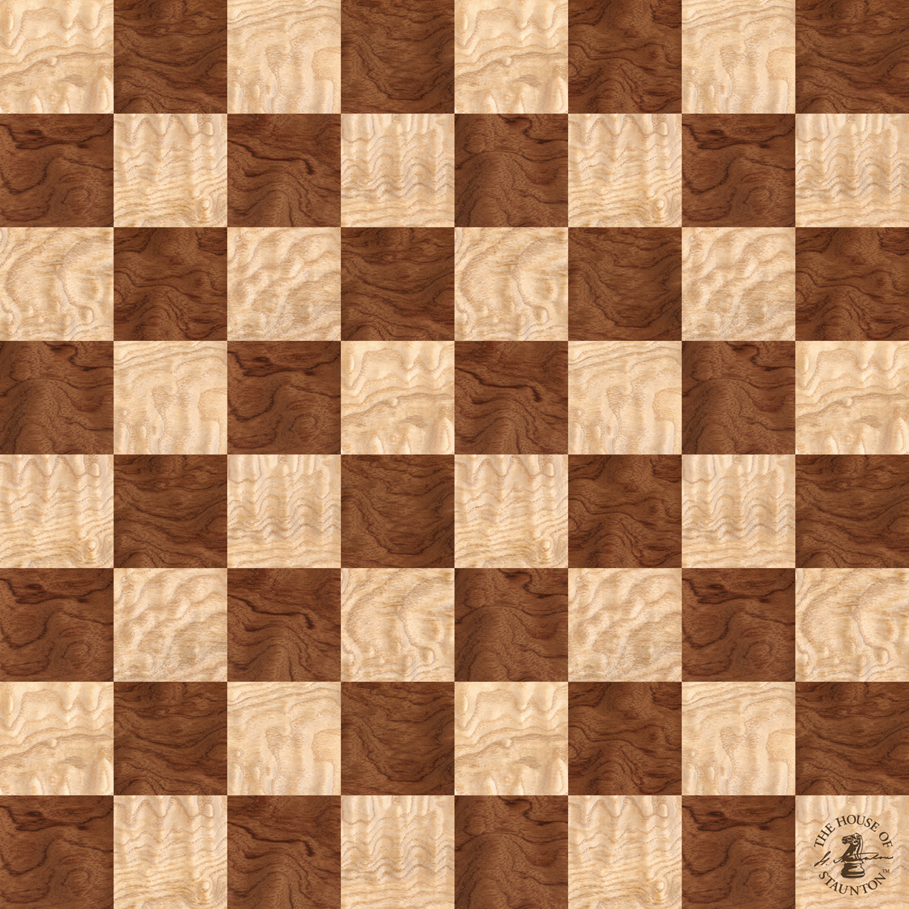

# chess.com-boards-and-pieces

This repository contains boards and sets of pieces from <strong>[chess.com](https://www.chess.com)</strong>.
</br>
Look at `data.json` file to see urls for each type of a board or set.


<!-- WHOLE_BOARD -->
<!-- Black Pieces -->
<p align="center">
    
    
    
    
    
    
    
    
</p>
<p align="center">
    
    
    
    
    
    
    
    
</p>

<!-- Board -->
<p align="center">
    
</p>

<!-- White Pieces -->
<p align="center">
    
    
    
    
    
    
    
    
</p>
<p align="center">
    
    
    
    
    
    
    
    
</p>
<!-- WHOLE_BOARD -->

## Downloading Boards and Pieces

To download boards and pieces from <strong>[chess.com](https://www.chess.com)</strong>, run:

```shell
python fetcher.py
# or
python fetcher.py -c/--config <CONFIG-FILE>
```


## Chess Position Renderer

The `render_position.py` script generates chess position images by combining board and piece PNGs based on a FEN string. It supports:

- Custom board styles and piece sets from the repository
- FEN notation input (including loading positions from `fen.json` by ID)
- Configurable square sizes
- Rendering from either player's perspective (white or black)
- Custom output filenames

### Installation

Install the required dependencies:

```bash
uv venv
source .venv/bin/activate
uv pip install -r requirements.txt
```

### Usage

```
usage: render_position.py [-h] [--fen FEN | --id ID] --board BOARD
                          --pieces PIECES [--size SIZE] [--side {white,black}]
                          [--output OUTPUT]

Render chess positions from FEN notation using chess.com board and piece images.

options:
  -h, --help            show this help message and exit
  --fen FEN             FEN string representing the chess position (default:
                        starting position if neither --fen nor --id provided)
  --id ID               Load FEN from fen.json by position ID
  --board BOARD         Board style name without .png extension (e.g.,
                        "brown", "marble")
  --pieces PIECES       Pieces directory name (e.g., "alpha", "3d_wood")
  --size SIZE           Size of each square in pixels (default: 80)
  --side {white,black}  Perspective to render from: white (bottom) or black
                        (top). Default: white
  --output OUTPUT       Output filename (default: chess_position.png)

Examples:
  # Starting position with brown board and alpha pieces
  render_position.py --board brown --pieces alpha --size 80

  # Custom position
  render_position.py --fen "r1bqkb1r/pppp1ppp/2n2n2/4p3/2B1P3/5N2/PPPP1PPP/RNBQK2R w KQkq - 4 4" --board marble --pieces 3d_wood --size 100
```
